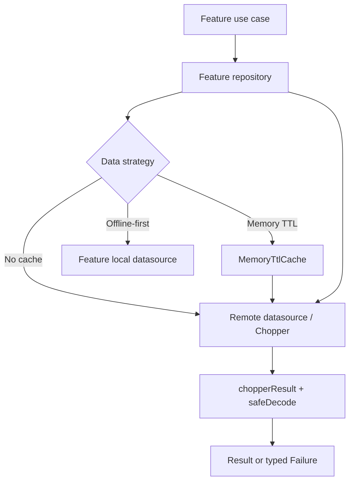

# API Client Architecture

`api_client` ends at transport and decoding. It never decides whether data is
fresh, persistent, or available offline. That decision is part of the feature's
repository implementation, where a developer can see both data sources and the
merge behavior in one place.

Use the sample references:

- `service_catalog`: no cache;
- `announcements`: memory TTL cache;
- `work_orders`: offline-first local source of truth.
